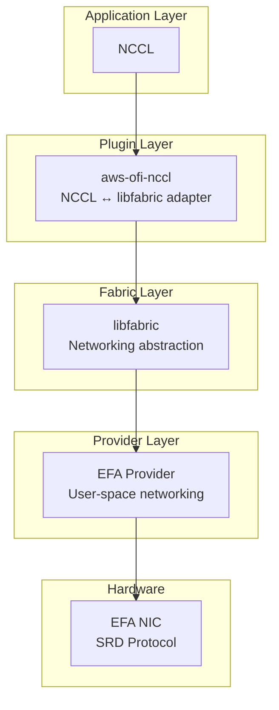
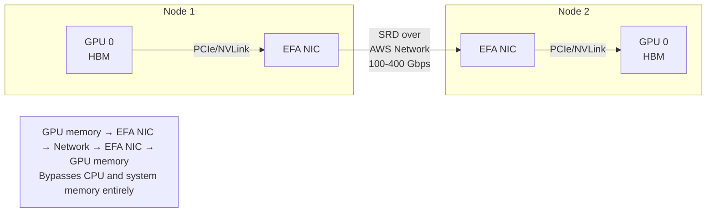
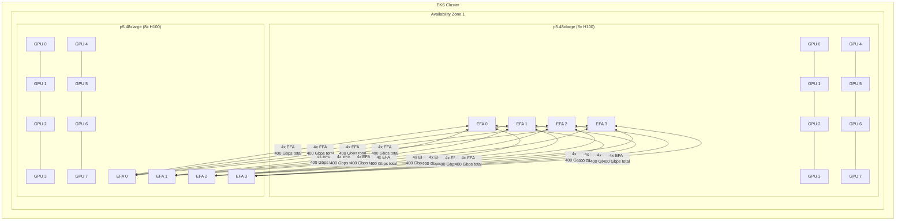

# AWS EFA Architecture

## EFA Network Stack

```mermaid
flowchart TB
    subgraph App["Application Layer"]
        NCCL[NCCL]
    end
    subgraph Plugin["Plugin Layer"]
        OFI[aws-ofi-nccl<br/>NCCL ↔ libfabric adapter]
    end
    subgraph Fabric["Fabric Layer"]
        LF[libfabric<br/>Networking abstraction]
    end
    subgraph Provider["Provider Layer"]
        EFA[EFA Provider<br/>User-space networking]
    end
    subgraph HW["Hardware"]
        NIC[EFA NIC<br/>SRD Protocol]
    end
    NCCL --> OFI --> LF --> EFA --> NIC
```

## GPUDirect RDMA Data Flow

```mermaid
flowchart LR
    subgraph Node1["Node 1"]
        GPU1[GPU 0<br/>HBM] -->|PCIe/NVLink| EFA1[EFA NIC]
    end
    subgraph Node2["Node 2"]
        EFA2[EFA NIC] -->|PCIe/NVLink| GPU2[GPU 0<br/>HBM]
    end
    EFA1 -->|SRD over<br/>AWS Network<br/>100-400 Gbps| EFA2
    Note1["GPU memory → EFA NIC → Network → EFA NIC → GPU memory<br/>Bypasses CPU and system memory entirely"]
```

## EKS Multi-Node Training Topology

```mermaid
flowchart TB
    subgraph EKS["EKS Cluster"]
        subgraph AZ1["Availability Zone 1"]
            subgraph N1["p5.48xlarge (8x H100)"]
                direction LR
                G0[GPU 0] --- G1[GPU 1] --- G2[GPU 2] --- G3[GPU 3]
                G4[GPU 4] --- G5[GPU 5] --- G6[GPU 6] --- G7[GPU 7]
                E1a[EFA 0] & E1b[EFA 1] & E1c[EFA 2] & E1d[EFA 3]
            end
            subgraph N2["p5.48xlarge (8x H100)"]
                direction LR
                G8[GPU 0] --- G9[GPU 1] --- G10[GPU 2] --- G11[GPU 3]
                G12[GPU 4] --- G13[GPU 5] --- G14[GPU 6] --- G15[GPU 7]
                E2a[EFA 0] & E2b[EFA 1] & E2c[EFA 2] & E2d[EFA 3]
            end
        end
    end
    E1a & E1b & E1c & E1d <-->|4x EFA<br/>400 Gbps total| E2a & E2b & E2c & E2d
```
