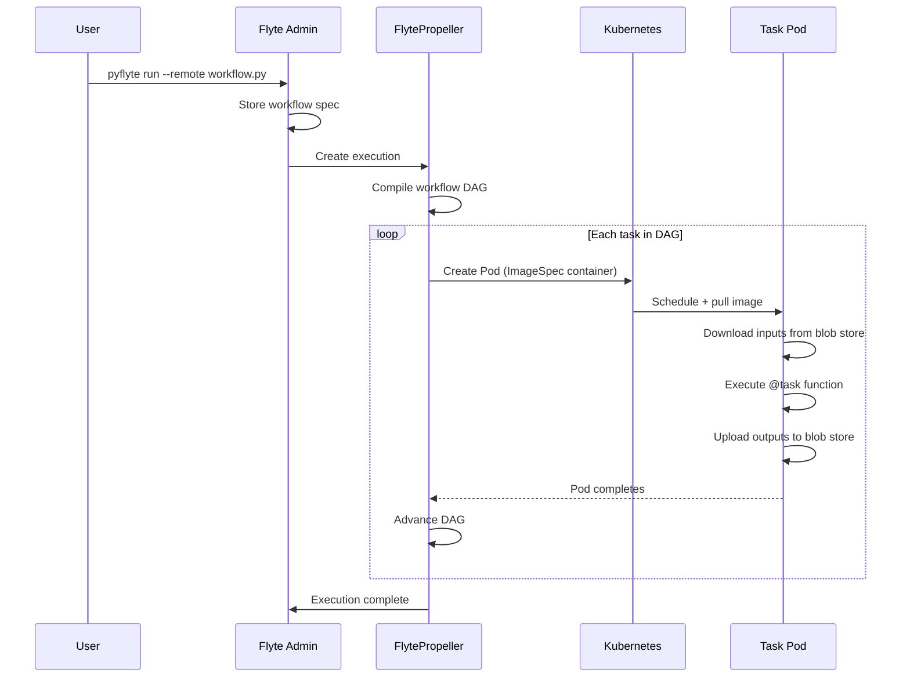
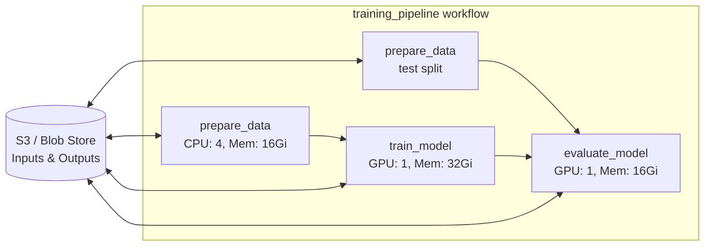
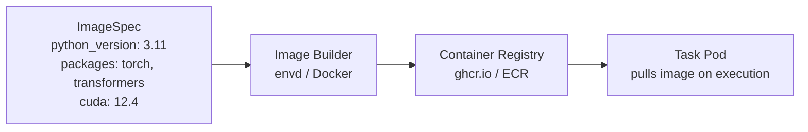

# Flyte Execution Architecture

## Task Execution Flow

```mermaid
sequenceDiagram
    participant User
    participant Admin as Flyte Admin
    participant Prop as FlytePropeller
    participant K8s as Kubernetes
    participant Pod as Task Pod

    User->>Admin: pyflyte run --remote workflow.py
    Admin->>Admin: Store workflow spec
    Admin->>Prop: Create execution
    Prop->>Prop: Compile workflow DAG
    loop Each task in DAG
        Prop->>K8s: Create Pod (ImageSpec container)
        K8s->>Pod: Schedule + pull image
        Pod->>Pod: Download inputs from blob store
        Pod->>Pod: Execute @task function
        Pod->>Pod: Upload outputs to blob store
        Pod-->>Prop: Pod completes
        Prop->>Prop: Advance DAG
    end
    Prop->>Admin: Execution complete
```

## Workflow DAG Example

```mermaid
flowchart LR
    subgraph Pipeline["training_pipeline workflow"]
        A[prepare_data<br/>CPU: 4, Mem: 16Gi] --> C[train_model<br/>GPU: 1, Mem: 32Gi]
        B[prepare_data<br/>test split] --> D[evaluate_model<br/>GPU: 1, Mem: 16Gi]
        C --> D
    end
    S3[(S3 / Blob Store<br/>Inputs & Outputs)] <--> A & B & C & D
```

## ImageSpec Build Flow

```mermaid
flowchart LR
    IS[ImageSpec<br/>python_version: 3.11<br/>packages: torch, transformers<br/>cuda: 12.4] --> Build[Image Builder<br/>envd / Docker]
    Build --> Registry[Container Registry<br/>ghcr.io / ECR]
    Registry --> Pod[Task Pod<br/>pulls image on execution]
```
