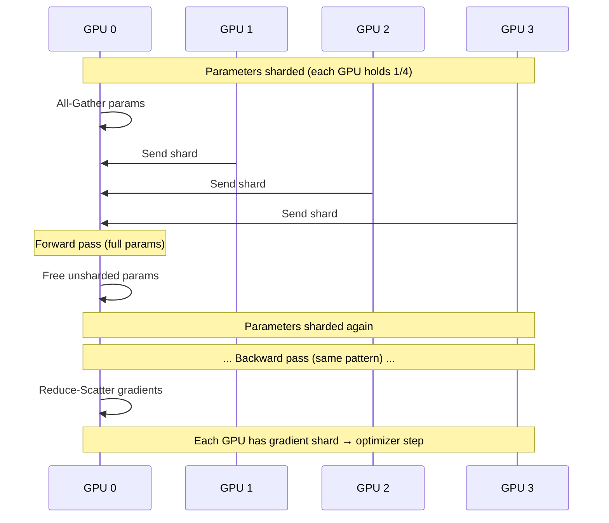
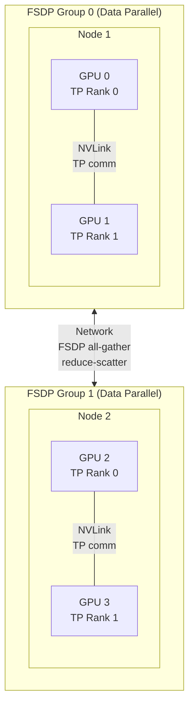
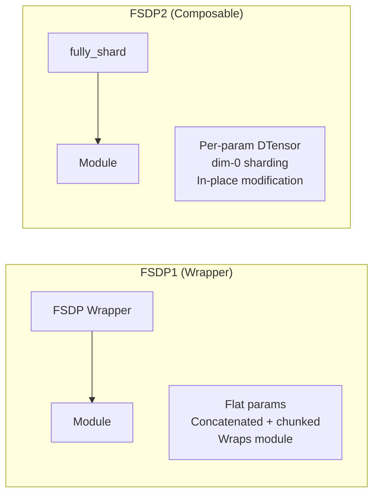

# FSDP Architecture

## FSDP Sharding Lifecycle

```mermaid
sequenceDiagram
    participant GPU0 as GPU 0
    participant GPU1 as GPU 1
    participant GPU2 as GPU 2
    participant GPU3 as GPU 3

    Note over GPU0,GPU3: Parameters sharded (each GPU holds 1/4)
    GPU0->>GPU0: All-Gather params
    GPU1->>GPU0: Send shard
    GPU2->>GPU0: Send shard
    GPU3->>GPU0: Send shard
    Note over GPU0: Forward pass (full params)
    GPU0->>GPU0: Free unsharded params
    Note over GPU0,GPU3: Parameters sharded again
    Note over GPU0,GPU3: ... Backward pass (same pattern) ...
    GPU0->>GPU0: Reduce-Scatter gradients
    Note over GPU0,GPU3: Each GPU has gradient shard → optimizer step
```

## 2D Parallelism (FSDP + Tensor Parallel)

```mermaid
flowchart TB
    subgraph DP0["FSDP Group 0 (Data Parallel)"]
        subgraph Node1["Node 1"]
            G0[GPU 0<br/>TP Rank 0] ---|NVLink<br/>TP comm| G1[GPU 1<br/>TP Rank 1]
        end
    end
    subgraph DP1["FSDP Group 1 (Data Parallel)"]
        subgraph Node2["Node 2"]
            G2[GPU 2<br/>TP Rank 0] ---|NVLink<br/>TP comm| G3[GPU 3<br/>TP Rank 1]
        end
    end
    DP0 <-->|Network<br/>FSDP all-gather<br/>reduce-scatter| DP1
```

## FSDP1 vs FSDP2

```mermaid
flowchart LR
    subgraph FSDP1["FSDP1 (Wrapper)"]
        direction TB
        W[FSDP Wrapper] --> M1[Module]
        Note1["Flat params<br/>Concatenated + chunked<br/>Wraps module"]
    end
    subgraph FSDP2["FSDP2 (Composable)"]
        direction TB
        FS[fully_shard] --> M2[Module]
        Note2["Per-param DTensor<br/>dim-0 sharding<br/>In-place modification"]
    end
```
