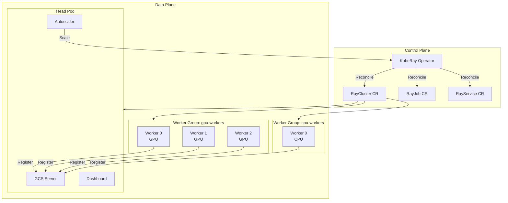
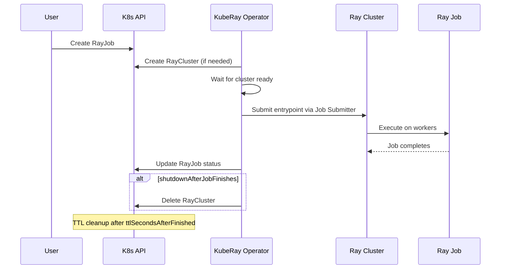
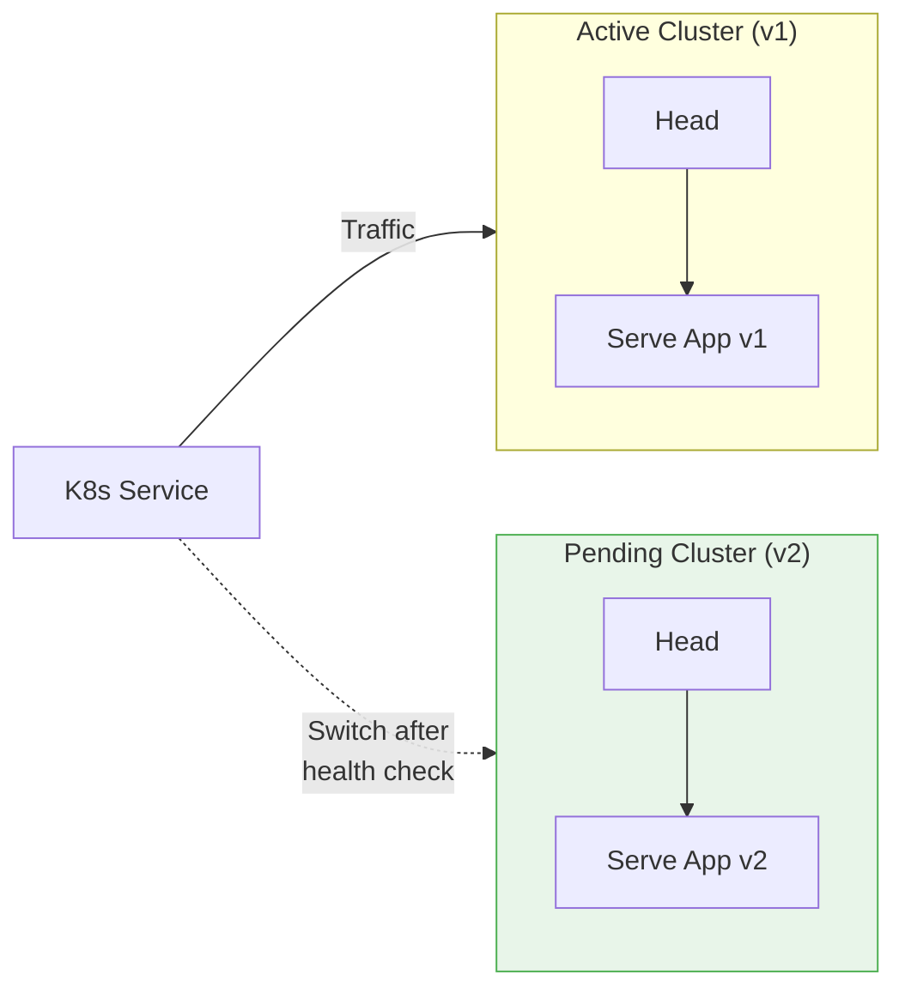

# KubeRay Architecture

## KubeRay Operator Flow

```mermaid
flowchart TB
    subgraph Control["Control Plane"]
        Op[KubeRay Operator] -->|Reconcile| RC[RayCluster CR]
        Op -->|Reconcile| RJ[RayJob CR]
        Op -->|Reconcile| RS[RayService CR]
    end
    subgraph Data["Data Plane"]
        subgraph Head["Head Pod"]
            GCS[GCS Server]
            Dash[Dashboard]
            Auto[Autoscaler]
        end
        subgraph WG1["Worker Group: gpu-workers"]
            W1[Worker 0<br/>GPU]
            W2[Worker 1<br/>GPU]
            W3[Worker 2<br/>GPU]
        end
        subgraph WG2["Worker Group: cpu-workers"]
            W4[Worker 0<br/>CPU]
        end
    end
    RC --> Head
    RC --> WG1
    RC --> WG2
    W1 & W2 & W3 & W4 -->|Register| GCS
    Auto -->|Scale| Op
```

## RayJob Lifecycle

```mermaid
sequenceDiagram
    participant User
    participant K8s as K8s API
    participant Op as KubeRay Operator
    participant Cluster as Ray Cluster
    participant Job as Ray Job

    User->>K8s: Create RayJob
    Op->>K8s: Create RayCluster (if needed)
    Op->>Op: Wait for cluster ready
    Op->>Cluster: Submit entrypoint via Job Submitter
    Cluster->>Job: Execute on workers
    Job-->>Cluster: Job completes
    Op->>K8s: Update RayJob status
    alt shutdownAfterJobFinishes
        Op->>K8s: Delete RayCluster
    end
    Note over K8s: TTL cleanup after ttlSecondsAfterFinished
```

## RayService Rolling Update

```mermaid
flowchart LR
    subgraph Active["Active Cluster (v1)"]
        H1[Head] --> S1[Serve App v1]
    end
    subgraph Pending["Pending Cluster (v2)"]
        H2[Head] --> S2[Serve App v2]
    end
    Svc[K8s Service] -->|Traffic| Active
    Svc -.->|Switch after<br/>health check| Pending
    style Pending fill:#e8f5e9,stroke:#4caf50
```
