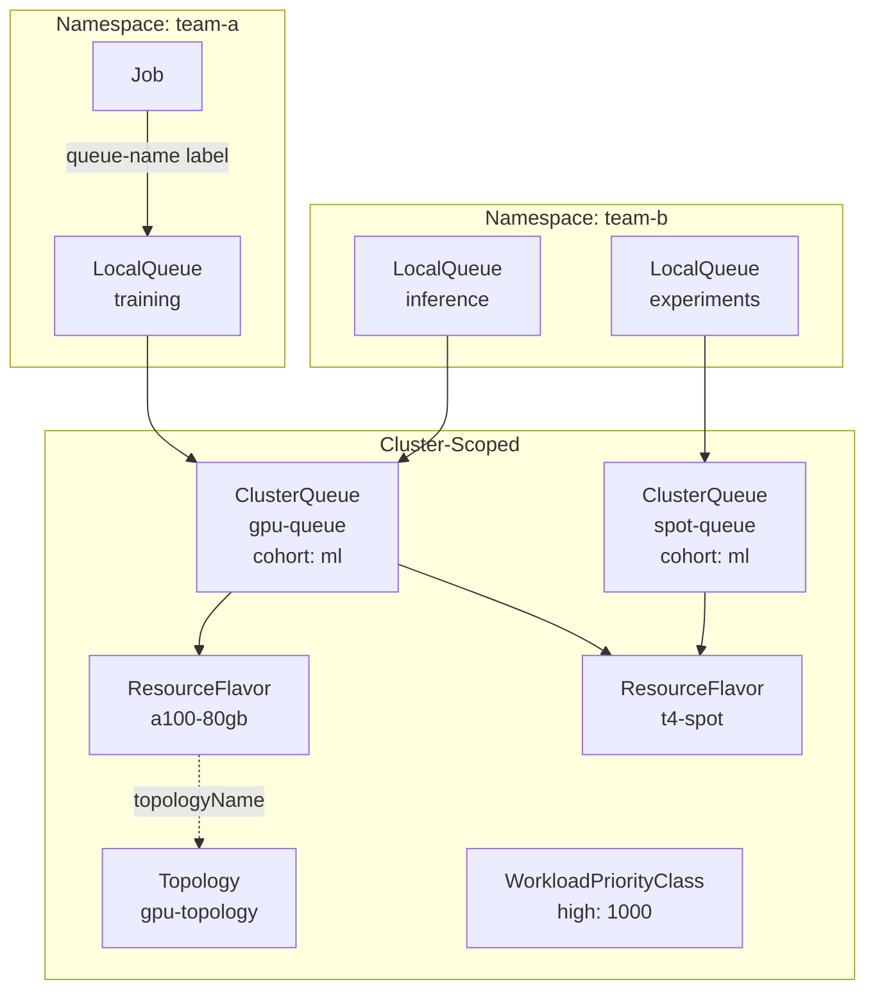
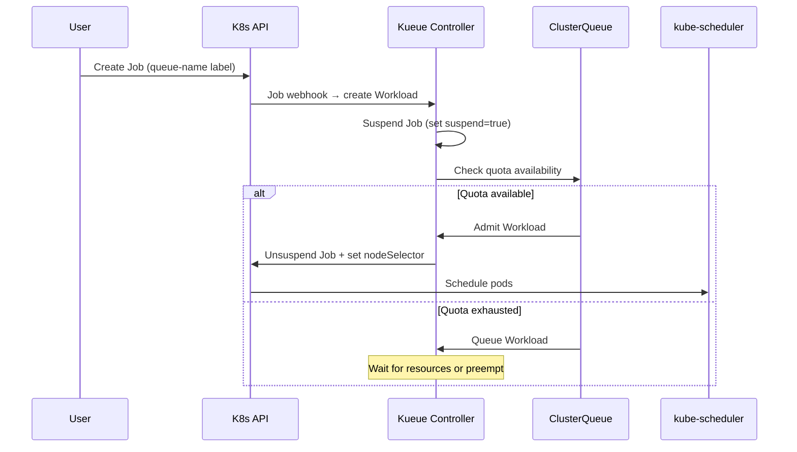
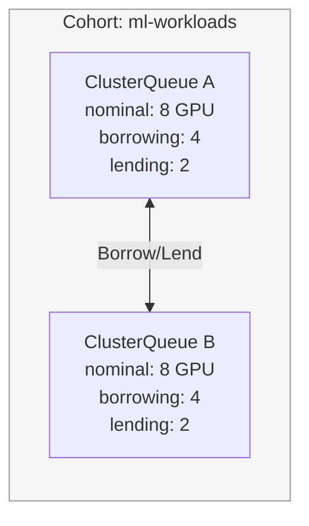

# Kueue Architecture

## Resource Model

```mermaid
flowchart TB
    subgraph Cluster["Cluster-Scoped"]
        CQ1[ClusterQueue<br/>gpu-queue<br/>cohort: ml]
        CQ2[ClusterQueue<br/>spot-queue<br/>cohort: ml]
        RF1[ResourceFlavor<br/>a100-80gb]
        RF2[ResourceFlavor<br/>t4-spot]
        T[Topology<br/>gpu-topology]
        WPC[WorkloadPriorityClass<br/>high: 1000]
    end
    subgraph NS1["Namespace: team-a"]
        LQ1[LocalQueue<br/>training] --> CQ1
        Job1[Job] -->|queue-name label| LQ1
    end
    subgraph NS2["Namespace: team-b"]
        LQ2[LocalQueue<br/>inference] --> CQ1
        LQ3[LocalQueue<br/>experiments] --> CQ2
    end
    CQ1 --> RF1
    CQ1 --> RF2
    CQ2 --> RF2
    RF1 -.->|topologyName| T
```

## Admission Flow

```mermaid
sequenceDiagram
    participant User
    participant K8s as K8s API
    participant Kueue as Kueue Controller
    participant CQ as ClusterQueue
    participant Sched as kube-scheduler

    User->>K8s: Create Job (queue-name label)
    K8s->>Kueue: Job webhook → create Workload
    Kueue->>Kueue: Suspend Job (set suspend=true)
    Kueue->>CQ: Check quota availability
    alt Quota available
        CQ->>Kueue: Admit Workload
        Kueue->>K8s: Unsuspend Job + set nodeSelector
        K8s->>Sched: Schedule pods
    else Quota exhausted
        CQ->>Kueue: Queue Workload
        Note over Kueue: Wait for resources or preempt
    end
```

## Borrowing & Fair Sharing (Cohort)

```mermaid
flowchart LR
    subgraph Cohort["Cohort: ml-workloads"]
        CQ1[ClusterQueue A<br/>nominal: 8 GPU<br/>borrowing: 4<br/>lending: 2]
        CQ2[ClusterQueue B<br/>nominal: 8 GPU<br/>borrowing: 4<br/>lending: 2]
    end
    CQ1 <-->|Borrow/Lend| CQ2
    style Cohort fill:#f5f5f5,stroke:#999
```
