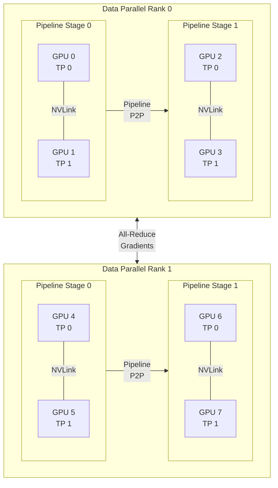
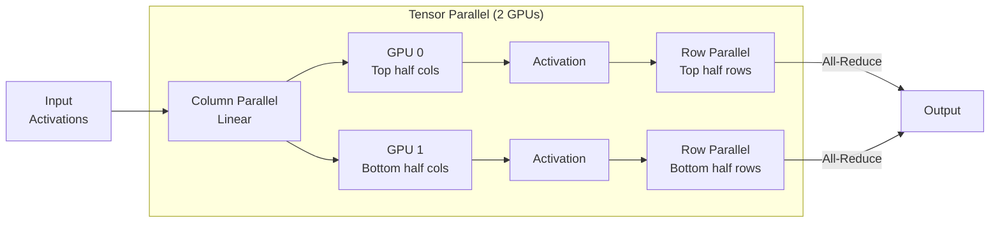

# Megatron-LM Parallelism Architecture

## 3D Parallelism Layout

```mermaid
flowchart TB
    subgraph DP0["Data Parallel Rank 0"]
        subgraph PP0_0["Pipeline Stage 0"]
            TP0_0[GPU 0<br/>TP 0] ---|NVLink| TP1_0[GPU 1<br/>TP 1]
        end
        subgraph PP1_0["Pipeline Stage 1"]
            TP0_1[GPU 2<br/>TP 0] ---|NVLink| TP1_1[GPU 3<br/>TP 1]
        end
        PP0_0 -->|Pipeline<br/>P2P| PP1_0
    end
    subgraph DP1["Data Parallel Rank 1"]
        subgraph PP0_1["Pipeline Stage 0"]
            TP0_2[GPU 4<br/>TP 0] ---|NVLink| TP1_2[GPU 5<br/>TP 1]
        end
        subgraph PP1_1["Pipeline Stage 1"]
            TP0_3[GPU 6<br/>TP 0] ---|NVLink| TP1_3[GPU 7<br/>TP 1]
        end
        PP0_1 -->|Pipeline<br/>P2P| PP1_1
    end
    DP0 <-->|All-Reduce<br/>Gradients| DP1
```

## Interleaved Pipeline Schedule (1F1B)

```mermaid
gantt
    title Pipeline Schedule (4 stages, 8 microbatches)
    dateFormat X
    axisFormat %s

    section Stage 0
    F0 :f0, 0, 1
    F1 :f1, 1, 2
    F2 :f2, 2, 3
    F3 :f3, 3, 4
    B3 :b3, 7, 8
    B2 :b2, 8, 9
    B1 :b1, 9, 10
    B0 :b0, 10, 11

    section Stage 1
    F0 :f0, 1, 2
    F1 :f1, 2, 3
    F2 :f2, 3, 4
    F3 :f3, 4, 5
    B3 :b3, 6, 7
    B2 :b2, 7, 8
    B1 :b1, 8, 9
    B0 :b0, 9, 10

    section Stage 2
    F0 :f0, 2, 3
    F1 :f1, 3, 4
    F2 :f2, 4, 5
    F3 :f3, 5, 6
    B3 :b3, 5, 6
    B2 :b2, 6, 7
    B1 :b1, 7, 8
    B0 :b0, 8, 9

    section Stage 3
    F0 :f0, 3, 4
    F1 :f1, 4, 5
    F2 :f2, 5, 6
    F3 :f3, 6, 7
    B3 :b3, 4, 5
    B2 :b2, 5, 6
    B1 :b1, 6, 7
    B0 :b0, 7, 8
```

## Tensor Parallel Split (Column + Row)

```mermaid
flowchart LR
    Input[Input<br/>Activations] --> Col[Column Parallel<br/>Linear]
    subgraph TP["Tensor Parallel (2 GPUs)"]
        Col --> G0[GPU 0<br/>Top half cols]
        Col --> G1[GPU 1<br/>Bottom half cols]
        G0 --> Act0[Activation]
        G1 --> Act1[Activation]
        Act0 --> Row0[Row Parallel<br/>Top half rows]
        Act1 --> Row1[Row Parallel<br/>Bottom half rows]
    end
    Row0 & Row1 -->|All-Reduce| Output[Output]
```
