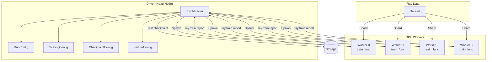
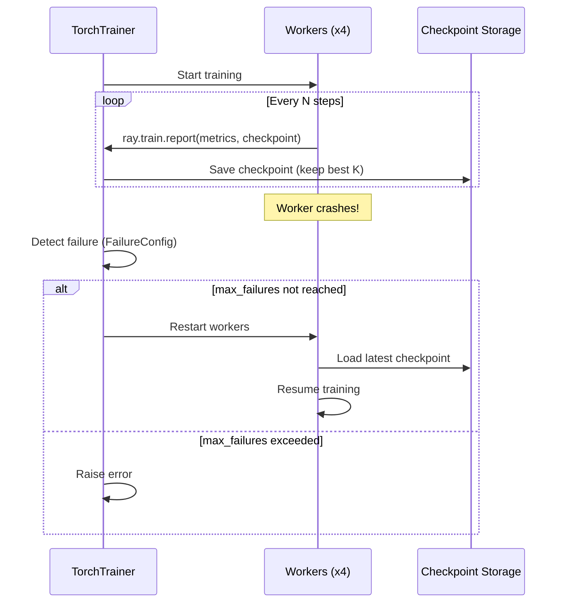

# Ray Train Architecture

## TorchTrainer Execution Flow

```mermaid
flowchart TB
    subgraph Driver["Driver (Head Node)"]
        TT[TorchTrainer] --> RC[RunConfig]
        TT --> SC[ScalingConfig]
        TT --> CC[CheckpointConfig]
        TT --> FC[FailureConfig]
    end
    subgraph Workers["GPU Workers"]
        TT -->|Spawn| W0[Worker 0<br/>train_func]
        TT -->|Spawn| W1[Worker 1<br/>train_func]
        TT -->|Spawn| W2[Worker 2<br/>train_func]
        TT -->|Spawn| W3[Worker 3<br/>train_func]
    end
    subgraph Data["Ray Data"]
        DS[Dataset] -->|Shard| W0
        DS -->|Shard| W1
        DS -->|Shard| W2
        DS -->|Shard| W3
    end
    W0 & W1 & W2 & W3 -->|ray.train.report| TT
    TT -->|Best checkpoint| Storage[(Storage)]
```

## Fault Tolerance Flow

```mermaid
sequenceDiagram
    participant TT as TorchTrainer
    participant W as Workers (x4)
    participant Ckpt as Checkpoint Storage

    TT->>W: Start training
    loop Every N steps
        W->>TT: ray.train.report(metrics, checkpoint)
        TT->>Ckpt: Save checkpoint (keep best K)
    end
    Note over W: Worker crashes!
    TT->>TT: Detect failure (FailureConfig)
    alt max_failures not reached
        TT->>W: Restart workers
        W->>Ckpt: Load latest checkpoint
        W->>W: Resume training
    else max_failures exceeded
        TT->>TT: Raise error
    end
```
