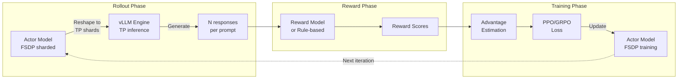
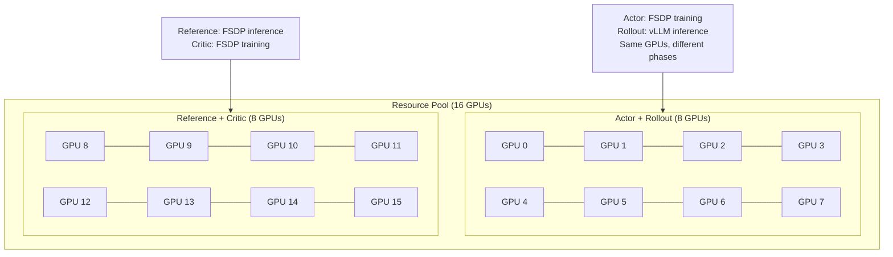
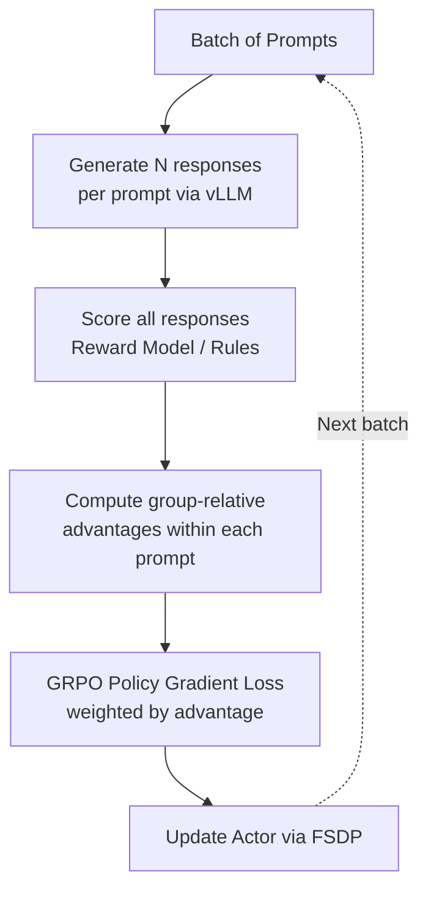

# verl Architecture

## 3D-HybridEngine Lifecycle (PPO/GRPO)

```mermaid
flowchart LR
    subgraph Rollout["Rollout Phase"]
        Actor1[Actor Model<br/>FSDP sharded] -->|Reshape to<br/>TP shards| vLLM[vLLM Engine<br/>TP inference]
        vLLM -->|Generate| Responses[N responses<br/>per prompt]
    end
    subgraph Reward["Reward Phase"]
        Responses --> RM[Reward Model<br/>or Rule-based]
        RM --> Scores[Reward Scores]
    end
    subgraph Training["Training Phase"]
        Scores --> Adv[Advantage<br/>Estimation]
        Adv --> PPO[PPO/GRPO<br/>Loss]
        PPO -->|Update| Actor2[Actor Model<br/>FSDP training]
    end
    Actor2 -.->|Next iteration| Actor1
```

## Resource Pool Allocation

```mermaid
flowchart TB
    subgraph Pool["Resource Pool (16 GPUs)"]
        subgraph ActorPool["Actor + Rollout (8 GPUs)"]
            direction LR
            AG0[GPU 0] --- AG1[GPU 1] --- AG2[GPU 2] --- AG3[GPU 3]
            AG4[GPU 4] --- AG5[GPU 5] --- AG6[GPU 6] --- AG7[GPU 7]
        end
        subgraph RefPool["Reference + Critic (8 GPUs)"]
            direction LR
            RG0[GPU 8] --- RG1[GPU 9] --- RG2[GPU 10] --- RG3[GPU 11]
            RG4[GPU 12] --- RG5[GPU 13] --- RG6[GPU 14] --- RG7[GPU 15]
        end
    end
    Note1[Actor: FSDP training<br/>Rollout: vLLM inference<br/>Same GPUs, different phases] --> ActorPool
    Note2[Reference: FSDP inference<br/>Critic: FSDP training] --> RefPool
```

## GRPO Data Flow

```mermaid
flowchart TB
    Prompts[Batch of Prompts] --> Gen[Generate N responses<br/>per prompt via vLLM]
    Gen --> Score[Score all responses<br/>Reward Model / Rules]
    Score --> Rank[Compute group-relative<br/>advantages within each prompt]
    Rank --> Loss[GRPO Policy Gradient Loss<br/>weighted by advantage]
    Loss --> Update[Update Actor via FSDP]
    Update -.->|Next batch| Prompts
```
