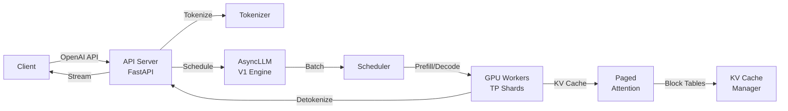
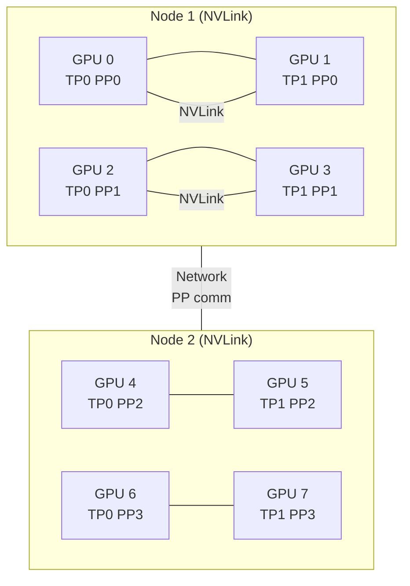
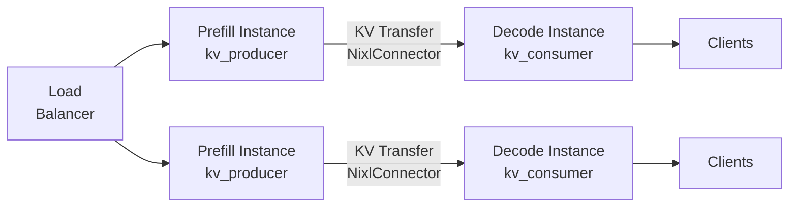

# vLLM Architecture

## Request Flow

```mermaid
flowchart LR
    Client -->|OpenAI API| APIServer[API Server<br/>FastAPI]
    APIServer -->|Tokenize| Tokenizer
    APIServer -->|Schedule| Engine[AsyncLLM<br/>V1 Engine]
    Engine -->|Batch| Scheduler
    Scheduler -->|Prefill/Decode| Workers[GPU Workers<br/>TP Shards]
    Workers -->|KV Cache| PagedAttn[Paged<br/>Attention]
    PagedAttn -->|Block Tables| KVCache[KV Cache<br/>Manager]
    Workers -->|Detokenize| APIServer
    APIServer -->|Stream| Client
```

## Multi-GPU Deployment (Tensor + Pipeline Parallelism)

```mermaid
flowchart TB
    subgraph Node1["Node 1 (NVLink)"]
        direction LR
        G0[GPU 0<br/>TP0 PP0] --- G1[GPU 1<br/>TP1 PP0]
        G2[GPU 2<br/>TP0 PP1] --- G3[GPU 3<br/>TP1 PP1]
        G0 ---|NVLink| G1
        G2 ---|NVLink| G3
    end
    subgraph Node2["Node 2 (NVLink)"]
        direction LR
        G4[GPU 4<br/>TP0 PP2] --- G5[GPU 5<br/>TP1 PP2]
        G6[GPU 6<br/>TP0 PP3] --- G7[GPU 7<br/>TP1 PP3]
    end
    Node1 ---|Network<br/>PP comm| Node2
```

## Disaggregated Prefill-Decode

```mermaid
flowchart LR
    LB[Load<br/>Balancer] --> P1[Prefill Instance<br/>kv_producer]
    LB --> P2[Prefill Instance<br/>kv_producer]
    P1 -->|KV Transfer<br/>NixlConnector| D1[Decode Instance<br/>kv_consumer]
    P2 -->|KV Transfer<br/>NixlConnector| D2[Decode Instance<br/>kv_consumer]
    D1 --> Client1[Clients]
    D2 --> Client2[Clients]
```
