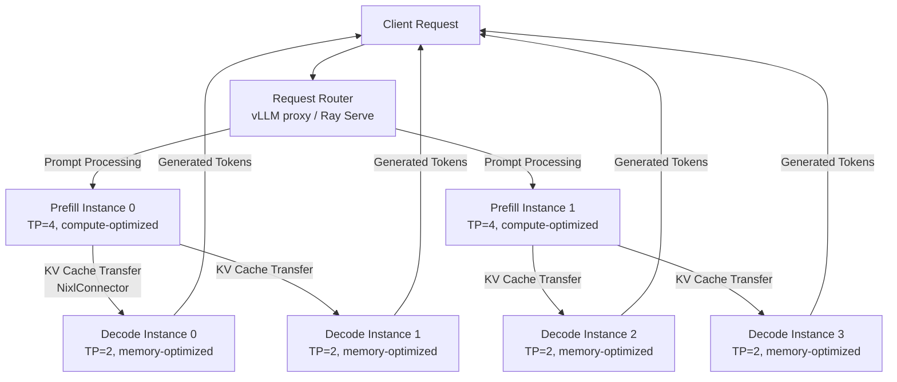
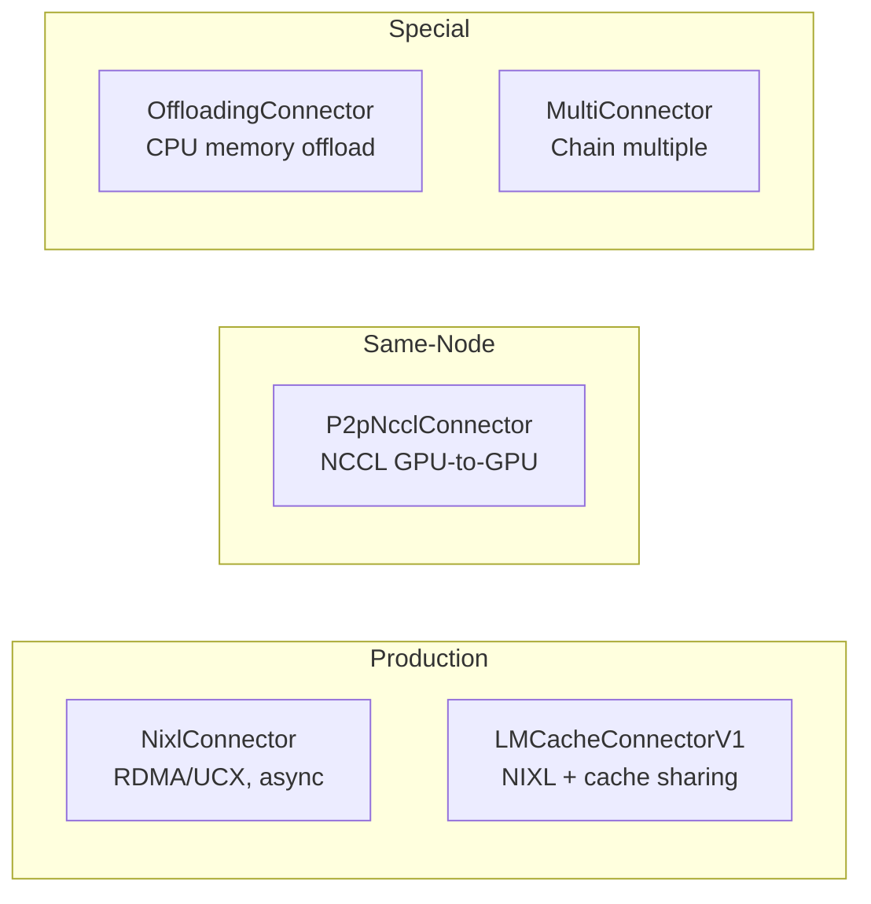

# Disaggregated Prefill-Decode Serving

Disaggregated prefill-decode (PD) serving separates the prefill phase (processing input prompts) and the decode phase (generating tokens) onto different vLLM instances for independent scaling and latency optimization.

## Why Disaggregated Serving?

1. **Independent TTFT and ITL tuning** — different parallelism strategies for prefill (compute-bound) and decode (memory-bound)
2. **Controlled tail latency** — decode instances are never interrupted by prefill work, eliminating ITL spikes
3. **Hardware optimization** — prefill benefits from larger TP; decode benefits from more KV cache headroom
4. **Independent scaling** — scale prefill for prompt-heavy workloads, decode for generation-heavy ones

> **Note:** Disaggregated prefill does NOT improve aggregate throughput. It improves latency characteristics and SLA compliance.

## Architecture



Two vLLM instance types run simultaneously:
- **Prefill instance** (`kv_role="kv_producer"` or `"kv_both"`) — processes prompts, produces KV caches
- **Decode instance** (`kv_role="kv_consumer"` or `"kv_both"`) — receives KV caches, generates tokens
- **Router** — directs prefill phase to prefill instances, decode phase to decode instances

## KVTransferConfig

All PD configuration is via `KVTransferConfig` kwargs passed to `LLM()` or `AsyncLLM`:

```python
from vllm import LLM
from vllm.config import KVTransferConfig

llm = LLM(
    model="meta-llama/Llama-3.1-70B-Instruct",
    tensor_parallel_size=4,
    kv_transfer_config=KVTransferConfig(
        kv_connector="NixlConnector",
        kv_role="kv_producer",
        kv_buffer_device="cuda",
    ),
)
```

### KVTransferConfig Fields

| Kwarg | Type | Default | Purpose |
|---|---|---|---|
| `kv_connector` | str | `None` | Connector implementation class name |
| `kv_role` | str | `None` | Instance role: `"kv_producer"`, `"kv_consumer"`, `"kv_both"` |
| `kv_buffer_device` | str | `"cuda"` | Buffer location: `"cuda"` (GPUDirect RDMA) or `"cpu"` (staged via host memory) |
| `kv_buffer_size` | float | `1e9` | Buffer size in bytes. Only used by TorchDistributedConnector. ~1 GB recommended. |
| `kv_rank` | int | `None` | Instance rank. Required for P2pNcclConnector (0=prefill, 1=decode). |
| `kv_parallel_size` | int | `1` | Number of parallel instances. Must be 2 for P2pNcclConnector. |
| `kv_ip` | str | `"127.0.0.1"` | IP address for distributed connection setup |
| `kv_port` | int | `14579` | Port for distributed connection setup |
| `kv_connector_extra_config` | dict | `{}` | Connector-specific settings (see below) |
| `kv_load_failure_policy` | str | `"recompute"` | Failure handling: `"recompute"` (retry locally) or `"fail"` (error immediately) |

### kv_role Selection

| Role | Behavior | Use Case |
|---|---|---|
| `"kv_producer"` | Only produces KV caches, never decodes | Dedicated prefill instance |
| `"kv_consumer"` | Only consumes KV caches, never prefills | Dedicated decode instance |
| `"kv_both"` | Can produce and consume | Flexible — router decides which phase each instance handles. **Recommended for production** since it enables better load balancing. |

### kv_buffer_device Performance

| Setting | Transfer Path | Latency | Bandwidth | Requirements |
|---|---|---|---|---|
| `"cuda"` | GPU → RDMA → GPU | ~2-10 μs | Full NIC bandwidth | GPUDirect RDMA support, RDMA-capable NIC |
| `"cpu"` | GPU → CPU → Network → CPU → GPU | ~100-500 μs | Limited by PCIe + network | Works everywhere but adds 2 PCIe copies |

**Always use `"cuda"` in production** with RDMA-capable networking (InfiniBand, EFA). Fall back to `"cpu"` only for testing or when RDMA is unavailable.

### kv_load_failure_policy

Controls behavior when KV cache transfer fails mid-request:

| Policy | Behavior | Trade-off |
|---|---|---|
| `"recompute"` (default) | Decode instance recomputes prefill locally | Higher latency for failed requests, but resilient |
| `"fail"` | Request fails immediately with error | Strict enforcement — use when monitoring PD health |

## Connector Types



| Connector | Transport | Async? | Best For | Limitations |
|---|---|---|---|---|
| `NixlConnector` | NIXL (UCX/RDMA/GDS) | ✅ Fully | **Production cross-node** | Requires UCX/libfabric |
| `LMCacheConnectorV1` | LMCache + NIXL | ✅ | Cross-node + KV dedup/offload | Additional LMCache dependency |
| `P2pNcclConnector` | NCCL P2P | ❌ | Same-node GPU-to-GPU | Exactly 2 instances only |
| `OffloadingConnector` | CPU memory | N/A | KV offload to host memory | Not for cross-node transfer |
| `MultiConnector` | Multiple | Varies | Chaining (e.g., NIXL + offload) | Configuration complexity |

### NixlConnector Settings

The primary production connector. Uses NIXL library for async KV transfer over UCX/RDMA.

```python
KVTransferConfig(
    kv_connector="NixlConnector",
    kv_role="kv_both",
    kv_buffer_device="cuda",
    kv_connector_extra_config={
        "backends": ["UCX"],       # NIXL backends: "UCX", "GDS" (GPU Direct Storage)
    },
)
```

#### NixlConnector Environment Variables

| Variable | Default | Purpose |
|---|---|---|
| `VLLM_NIXL_SIDE_CHANNEL_PORT` | `5600` | Port for NIXL handshake between instances. Each worker needs a unique port on the same host. With DP, port = `base_port + dp_rank`. |
| `VLLM_NIXL_SIDE_CHANNEL_HOST` | `localhost` | Hostname for side channel. **Must be set to externally reachable address when prefill and decode are on different nodes.** |
| `VLLM_NIXL_ABORT_REQUEST_TIMEOUT` | `480` | Seconds before releasing KV cache blocks for aborted requests if decode hasn't read them. |
| `UCX_TLS` | auto | UCX transports. `all` to auto-select, or specify: `rc,ud,sm` (InfiniBand), `tcp` (fallback). |
| `UCX_NET_DEVICES` | auto | Network devices. `all` or specific: `mlx5_0:1,mlx5_1:1` (InfiniBand), EFA devices. |

#### NixlConnector Backend Selection

| Backend | Transport | When to Use |
|---|---|---|
| `"UCX"` (default) | UCX library — auto-selects best transport (RDMA > shared memory > TCP) | General purpose, works with InfiniBand, EFA, Ethernet |
| `"GDS"` | GPU Direct Storage — reads KV cache from storage directly into GPU | When KV cache is persisted to NVMe/storage |

Multiple backends can be specified: `"backends": ["UCX", "GDS"]` — NIXL selects the optimal one per transfer.

### P2pNcclConnector Settings

For same-node GPU-to-GPU transfer. Simpler but limited to exactly 2 instances.

```python
# Prefill (GPU 0)
KVTransferConfig(
    kv_connector="P2pNcclConnector",
    kv_role="kv_producer",
    kv_rank=0,
    kv_parallel_size=2,
)

# Decode (GPU 1)
KVTransferConfig(
    kv_connector="P2pNcclConnector",
    kv_role="kv_consumer",
    kv_rank=1,
    kv_parallel_size=2,
)
```

| Setting | Requirement |
|---|---|
| `kv_parallel_size` | Must be `2` |
| `kv_rank` | `0` for prefill, `1` for decode |
| Same node | Both instances must be on the same machine with NVLink/PCIe GPU connectivity |

### OffloadingConnector Settings

Offloads KV cache to CPU memory. Use standalone or chain with MultiConnector.

```python
KVTransferConfig(
    kv_connector="OffloadingConnector",
    kv_role="kv_both",
    kv_connector_extra_config={
        "block_size": 64,                      # Tokens per block
        "cpu_bytes_to_use": 10_000_000_000,    # 10 GB CPU memory budget
    },
)
```

| Setting | Default | Purpose |
|---|---|---|
| `block_size` | — | Tokens per KV cache block. Larger = fewer transfers, more memory per block. |
| `cpu_bytes_to_use` | — | Maximum CPU memory for offloaded KV cache. Size based on expected concurrent sequences. |

### MultiConnector (Chaining)

Combine connectors for hybrid strategies — e.g., NIXL for cross-node + offloading for overflow:

```python
KVTransferConfig(
    kv_connector="MultiConnector",
    kv_role="kv_both",
    kv_connector_extra_config={
        "connectors": [
            {"kv_connector": "NixlConnector", "kv_role": "kv_both"},
            {"kv_connector": "OffloadingConnector", "kv_role": "kv_both",
             "kv_connector_extra_config": {"block_size": 64, "cpu_bytes_to_use": 10_000_000_000}},
        ],
    },
)
```

## Compatibility and Constraints

### Model Requirements

Both prefill and decode instances **must** use identical:
- Model and revision
- `dtype`
- `block_size` (KV cache block size)
- `max_model_len` (or compatible values)

Mismatches cause `ValueError` or garbled output after KV transfer.

### Feature Compatibility

| Feature | Compatible with PD? | Notes |
|---|---|---|
| Prefix caching | ✅ | Works on both prefill and decode independently |
| Chunked prefill | ✅ | Enabled by default in V1 |
| LoRA adapters | ✅ | Same adapters must be available on both instances |
| Speculative decoding | ⚠️ | Only on decode instance; prefill doesn't speculate |
| FP8 KV cache | ✅ | Both instances must use same `kv_cache_dtype` |
| Pipeline parallelism | ⚠️ | Supported but adds complexity — TP-only preferred for PD |
| Structured output | ✅ | Enforced on decode instance |
| Vision/multimodal | ✅ | Prefill handles image encoding, KV includes vision tokens |

### Network Requirements

KV cache size per request: `num_layers × num_kv_heads × head_dim × seq_len × 2 (K+V) × dtype_bytes`

| Model | Context | KV Size/Request | Minimum Network |
|---|---|---|---|
| Llama 8B (bf16) | 8K | ~1 GB | 25 Gbps |
| Llama 70B (bf16) | 8K | ~5 GB | 100 Gbps |
| Llama 70B (fp8 KV) | 8K | ~2.5 GB | 50 Gbps |
| DeepSeek-V3 (bf16) | 8K | ~8 GB | 200 Gbps |

**Rule of thumb**: If KV transfer latency exceeds 50% of prefill compute time, PD disaggregation hurts rather than helps.

## Performance Optimization

### Prefill Instance Tuning

Prefill is compute-bound — optimize for throughput:

```python
prefill_llm = LLM(
    model="meta-llama/Llama-3.1-70B-Instruct",
    tensor_parallel_size=4,                  # Higher TP for faster prefill
    enable_chunked_prefill=True,
    max_num_batched_tokens=32768,            # Large chunks for GPU utilization
    gpu_memory_utilization=0.85,             # Less KV cache needed (short-lived)
    kv_transfer_config=KVTransferConfig(
        kv_connector="NixlConnector",
        kv_role="kv_both",
        kv_buffer_device="cuda",
    ),
)
```

### Decode Instance Tuning

Decode is memory-bound — optimize for KV cache capacity:

```python
decode_llm = LLM(
    model="meta-llama/Llama-3.1-70B-Instruct",
    tensor_parallel_size=2,                  # Lower TP, more memory per GPU
    gpu_memory_utilization=0.95,             # Maximum KV cache
    max_num_seqs=512,                        # High concurrency
    kv_cache_dtype="fp8",                    # Halve KV cache memory + transfer size
    enable_prefix_caching=True,              # Reuse across requests
    kv_transfer_config=KVTransferConfig(
        kv_connector="NixlConnector",
        kv_role="kv_both",
        kv_buffer_device="cuda",
        kv_load_failure_policy="recompute",  # Resilient to transfer failures
    ),
)
```

### Scaling Ratios

| Workload | Prefill:Decode Ratio | Why |
|---|---|---|
| Chat (short prompts, long generation) | 1:4 | Decode is the bottleneck |
| RAG (long prompts, short answers) | 2:1 | Prefill is the bottleneck |
| Code generation (medium both) | 1:2 | Balanced |
| Batch processing | 1:1 | Even load |

Monitor `vllm:num_requests_running` and `vllm:num_requests_waiting` on each instance type to tune ratios.

## Request Routing

### vLLM Proxy (OpenAI API)

```python
from openai import OpenAI
import uuid

prefill_client = OpenAI(base_url="http://prefill-svc:8100/v1", api_key="EMPTY")
decode_client = OpenAI(base_url="http://decode-svc:8200/v1", api_key="EMPTY")

request_id = str(uuid.uuid4())
model = prefill_client.models.list().data[0].id

# Phase 1: Prefill — produces KV cache, returns transfer params
prefill_resp = prefill_client.completions.create(
    model=model,
    prompt="Explain the architecture of transformer models in detail",
    max_tokens=1,
    extra_body={
        "kv_transfer_params": {
            "do_remote_decode": True,
            "do_remote_prefill": False,
        }
    },
    extra_headers={"X-Request-Id": request_id},
)

# Phase 2: Decode — uses transferred KV cache
decode_resp = decode_client.completions.create(
    model=model,
    prompt="ignored",
    max_tokens=512,
    extra_body={
        "kv_transfer_params": prefill_resp.kv_transfer_params,
    },
    extra_headers={"X-Request-Id": request_id},
)
```

### Ray Serve PD Integration

Ray Serve provides `build_pd_openai_app` for native PD routing — see [ray-serve](../../ray-serve/) skill.

## Disaggregated Serving with MOE Models

MOE models benefit strongly from PD disaggregation because prefill and decode have different expert communication patterns:

- **Prefill**: Many tokens, many experts active → benefits from high-throughput all2all
- **Decode**: Few tokens per step, sparse activation → benefits from low-latency all2all

```python
# MOE Prefill instance
prefill_llm = LLM(
    model="deepseek-ai/DeepSeek-V3-0324",
    enable_expert_parallel=True,
    tensor_parallel_size=1,
    data_parallel_size=8,
    all2all_backend="deepep_high_throughput",   # Optimized for large batches
    kv_transfer_config=KVTransferConfig(
        kv_connector="NixlConnector",
        kv_role="kv_both",
    ),
)

# MOE Decode instance
decode_llm = LLM(
    model="deepseek-ai/DeepSeek-V3-0324",
    enable_expert_parallel=True,
    tensor_parallel_size=1,
    data_parallel_size=8,
    all2all_backend="deepep_low_latency",       # Optimized for small batches
    kv_transfer_config=KVTransferConfig(
        kv_connector="NixlConnector",
        kv_role="kv_both",
    ),
)
```

See `references/moe-serving.md` for complete MOE/EP configuration.

## Troubleshooting

### KV Cache Transfer Failures

**Symptom**: Decode instance hangs or requests time out.

| Check | Fix |
|---|---|
| NIXL side channel unreachable | Verify `VLLM_NIXL_SIDE_CHANNEL_PORT` is open between instances. For cross-node, set `VLLM_NIXL_SIDE_CHANNEL_HOST` to external address. |
| UCX device mismatch | `UCX_NET_DEVICES` must match available NICs. Use `all` to auto-detect. |
| Model mismatch | Both instances must use identical model, dtype, block_size, max_model_len. |
| Roles swapped | Verify producer/consumer assignment. Start with `kv_both` to rule out. |
| Firewall | NIXL side channel port AND UCX ephemeral ports must be open. |
| CUDA graphs | Start with `enforce_eager=True` to rule out graph capture issues. |

### High Transfer Latency

**Symptom**: TTFT worse than monolithic serving.

| Cause | Fix |
|---|---|
| TCP fallback instead of RDMA | Check `UCX_TLS` includes `rc` for InfiniBand. Verify EFA/RDMA NIC availability. |
| CPU buffer path | Set `kv_buffer_device="cuda"` for GPUDirect RDMA. |
| Insufficient bandwidth | See network requirements table above. Use FP8 KV cache to halve transfer size. |
| Side channel host wrong | For cross-node, `VLLM_NIXL_SIDE_CHANNEL_HOST` must be externally reachable. |

### Load Imbalance

**Symptom**: One instance type idle while the other is overloaded.

| Fix | Details |
|---|---|
| Adjust replica ratio | See scaling ratios table. Monitor `vllm:num_requests_running` per instance. |
| Use `kv_both` | Allows instances to handle both phases; router decides scheduling. |
| Ray Serve autoscaling | Different `min_replicas`/`max_replicas` for prefill vs decode configs. |
